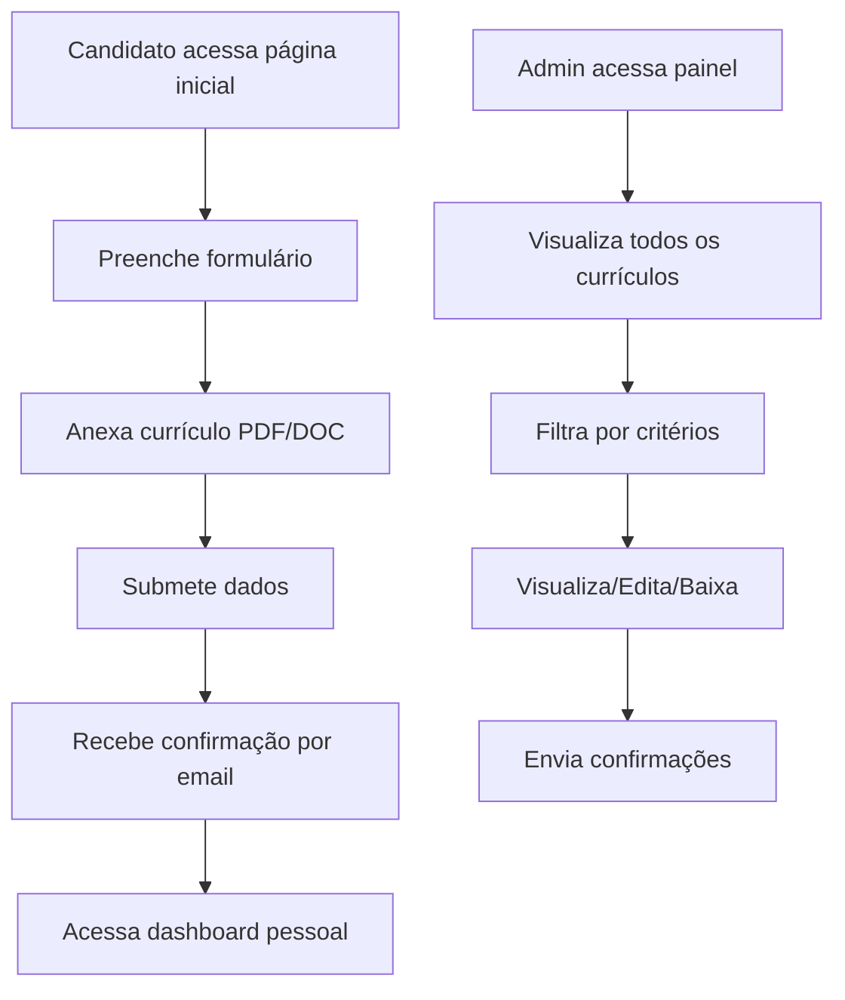

# 🏥 Sistema de Cadastro de Currículos - SESAP

<div align="center">

[](https://php.net)
[](https://mysql.com)
[](https://httpd.apache.org)


**Sistema web moderno para cadastro e gerenciamento de currículos**

[🚀 Instalação](#-instalação) • [📖 Como Usar](#-como-usar) • [🔧 Configuração](#-configuração) • [🐛 Suporte](#-suporte)

</div>

---

## 📋 Índice

- [🎯 Sobre o Projeto](#-sobre-o-projeto)
- [✨ Funcionalidades](#-funcionalidades)
- [🛠️ Tecnologias](#️-tecnologias)
- [📋 Pré-requisitos](#-pré-requisitos)
- [🚀 Instalação](#-instalação)
- [🔧 Configuração](#-configuração)
- [📖 Como Usar](#-como-usar)
- [📁 Estrutura do Projeto](#-estrutura-do-projeto)
- [🔐 Segurança](#-segurança)
- [🐛 Solução de Problemas](#-solução-de-problemas)
- [📞 Suporte](#-suporte)

---

## 🎯 Sobre o Projeto

O Sistema de Cadastro de Currículos SESAP é uma aplicação web desenvolvida inicialmente em localhost, especificamente para facilitar o processo de recrutamento e seleção da Secretaria de Estado da Saúde Pública do Rio Grande do Norte.
 

### 🌟 Principais Características

- 🎨 **Interface Moderna**: Design responsivo e intuitivo
- 🔒 **Seguro**: Proteção contra vulnerabilidades comuns
- 📱 **Mobile-First**: Otimizado para dispositivos móveis
- 📧 **Notificações**: Sistema automático de emails
- 🔍 **Busca Avançada**: Filtros inteligentes para administradores

---

## ✨ Funcionalidades

### 👤 Para Candidatos
- ✅ Formulário de cadastro intuitivo e responsivo
- ✅ Upload de currículos (PDF, DOC, DOCX) - máximo 1MB
- ✅ Validação em tempo real dos dados
- ✅ Confirmação automática por email
- ✅ Dashboard pessoal para acompanhar status
- ✅ Interface acessível e moderna

### 👨‍💼 Para Administradores
- ✅ Painel administrativo completo
- ✅ Sistema de busca e filtros avançados
- ✅ Visualização detalhada de currículos
- ✅ Download de arquivos anexados
- ✅ Envio de emails de confirmação
- ✅ Gerenciamento completo (editar/excluir)

### 🔧 Recursos Técnicos
- ✅ Arquitetura MVC organizada
- ✅ Validação dupla (frontend/backend)
- ✅ Proteção contra SQL Injection
- ✅ Sistema de logs detalhado
- ✅ Backup automático de dados
- ✅ Interface responsiva (mobile-first)

---

## 🛠️ Tecnologias

| Categoria | Tecnologia | Versão |
|-----------|------------|--------|
| **Backend** | PHP | 8.2+ |
| **Banco de Dados** | MySQL | 8.0+ |
| **Servidor Web** | Apache/Nginx | 2.4+ |
| **Frontend** | HTML5, CSS3, JavaScript | ES6+ |
| **Email** | PHPMailer | 6.10+ |
| **Dependências** | Composer | 2.0+ |

---

## 📋 Pré-requisitos

Antes de começar, certifique-se de ter instalado:

- ✅ **PHP 8.0+** com extensões: `pdo`, `pdo_mysql`, `mbstring`, `openssl`
- ✅ **MySQL 8.0+** ou MariaDB 10.4+
- ✅ **Apache 2.4+** ou Nginx 1.18+
- ✅ **Composer** (gerenciador de dependências PHP)
- ✅ **Conta SMTP** (Gmail recomendado para emails)

### 🖥️ Para Windows (XAMPP)
- ✅ **XAMPP 8.2+** - [Download aqui](https://sourceforge.net/projects/xampp/files/)
- ✅ **Git** - [Download aqui](https://git-scm.com/download/win)
- ✅ **VS Code** - [Download aqui](https://code.visualstudio.com/download)

---

## 🚀 Instalação

### Método 1: Instalação com XAMPP (Windows)

#### 1️⃣ Preparar o Ambiente
```powershell
# Baixe e instale o XAMPP
# Inicie o Apache e MySQL no painel de controle do XAMPP
```

#### 2️⃣ Clonar o Projeto
```powershell
# Navegue até a pasta htdocs do XAMPP
cd C:\xampp\htdocs
# Os arquivos do projeto deve está no caminho 
cd C:\xampp\htdocs

# Clone o repositório
git clone [url-do-repositorio] sesap_curriculo
cd sesap_curriculo
```

#### 3️⃣ Instalar Dependências
```powershell
# Instale o Composer se não tiver
# Depois execute:
composer install
```

#### 4️⃣ Configurar Banco de Dados
```sql
-- Acesse o phpMyAdmin (http://localhost/phpmyadmin)
-- Ou use o MySQL via linha de comando:

-- Criar banco de dados
CREATE DATABASE sesap_curriculo CHARACTER SET utf8mb4 COLLATE utf8mb4_unicode_ci;

-- Usar o banco
USE sesap_curriculo;

-- Importar estrutura
SOURCE database/database.sql;

-- (Opcional) Atualizar timezone
SOURCE database/update_timezone.sql;
```

#### 5️⃣ Configurar Sistema
```powershell
# Copie o arquivo de exemplo
copy includes\config.example.php includes\config.php

# Edite o arquivo includes\config.php com suas configurações
```

### Método 2: Instalação Manual (Linux/Mac)

#### 1️⃣ Clonar e Preparar
```bash
git clone [url-do-repositorio] sesap_curriculo
cd sesap_curriculo
composer install
```

#### 2️⃣ Configurar Banco
```bash
mysql -u root -p -e "CREATE DATABASE sesap_curriculo CHARACTER SET utf8mb4 COLLATE utf8mb4_unicode_ci;"
mysql -u root -p sesap_curriculo < database/database.sql
```

#### 3️⃣ Configurar Permissões
```bash
chmod 755 uploads/
chmod 644 uploads/.htaccess
chown -R www-data:www-data uploads/
```

---

## 🔧 Configuração

### 📝 Arquivo de Configuração

Edite o arquivo <mcfile name="config.php" path="includes/config.php"></mcfile>:

```php
<?php
// 🗄️ Configurações do Banco de Dados
define('DB_HOST', 'localhost');
define('DB_NAME', 'sesap_curriculo');
define('DB_USER', 'root');           // Seu usuário MySQL
define('DB_PASS', '');               // Sua senha MySQL

// 📧 Configurações SMTP (Gmail)
define('SMTP_HOST', 'smtp.gmail.com');
define('SMTP_PORT', 587);
define('SMTP_USERNAME', 'seu_email@gmail.com');
define('SMTP_PASSWORD', 'sua_senha_de_app');    // Senha de app do Gmail
define('EMAIL_FROM', 'seu_email@gmail.com');
define('EMAIL_TO', 'rh@sesap.rn.gov.br');

// 🔐 Configurações de Segurança
define('UPLOAD_MAX_SIZE', 1048576);  // 1MB em bytes
define('ALLOWED_EXTENSIONS', ['pdf', 'doc', 'docx']);
?>
```

### 📧 Configuração do Gmail

1. **Ativar 2FA**: Vá em Configurações → Segurança → Verificação em duas etapas
2. **Gerar Senha de App**: Configurações → Segurança → Senhas de app
3. **Usar a Senha**: Cole a senha gerada no `SMTP_PASSWORD`

---

## 🖼️ Demonstração do Sistema

### 🎨 Interfaces do Sistema

O sistema possui três interfaces principais, cada uma com design moderno e responsivo:

#### 🏠 **Página Inicial** - Portal de Cadastro
- **Design**: Interface limpa com gradiente azul/roxo
- **Funcionalidades**: Formulário de cadastro completo para candidatos
- **Elementos**: Campos validados, upload de arquivo, botões de ação
- **Responsividade**: Otimizada para desktop e mobile

#### 👤 **Área do Candidato** - Dashboard Pessoal
- **Design**: Layout moderno com cards informativos
- **Funcionalidades**: Visualização dos dados enviados, status da candidatura
- **Elementos**: Informações pessoais, dados do currículo, ações disponíveis
- **Segurança**: Acesso via email cadastrado

#### 👨‍💼 **Painel Administrativo** - Gestão Completa
- **Design**: Interface profissional com tabelas e filtros
- **Funcionalidades**: CRUD completo, busca avançada, downloads
- **Elementos**: Estatísticas, listagem paginada, ações em lote
- **Recursos**: Visualização detalhada, edição inline, confirmações

### 🎯 Fluxo de Uso



### 📱 Responsividade

O sistema é **mobile-first** e se adapta perfeitamente a:
- 📱 **Smartphones** (320px+)
- 📱 **Tablets** (768px+)
- 💻 **Desktops** (1024px+)
- 🖥️ **Telas grandes** (1440px+)

---

## 📖 Como Usar

### 🌐 URLs de Acesso

| Área | URL | Descrição |
|------|-----|-----------|
| **Página Inicial** | `http://localhost/sesap_curriculo/public/index.html` | Landing page do sistema |
| **Área do Usuário** | `http://localhost/sesap_curriculo/pages/user/user_login.php` | Portal do candidato |
| **Área Administrativa** | `http://localhost/sesap_curriculo/pages/admin/login.php` | Painel administrativo |

### 👤 Para Candidatos

1. **Acesse** a área do usuário
2. **Cadastre-se** preenchendo todos os campos obrigatórios
3. **Anexe** seu currículo (PDF, DOC ou DOCX - máx. 1MB)
4. **Envie** o formulário
5. **Confirme** através do email recebido
6. **Acompanhe** o status no dashboard pessoal

### 👨‍💼 Para Administradores

**Credenciais Padrão:**
- 👤 **Usuário:** `SESAP`
- 🔑 **Senha:** `admin123`

> ⚠️ **IMPORTANTE**: Altere essas credenciais em produção!

**Funcionalidades:**
1. **Login** com credenciais administrativas
2. **Visualizar** todos os currículos cadastrados
3. **Filtrar** por nome, email, cargo ou data
4. **Baixar** currículos em PDF
5. **Editar** informações dos candidatos
6. **Excluir** registros quando necessário
7. **Enviar** emails de confirmação

---

## 📁 Estrutura do Projeto

```
sesap_curriculo/
├── 📁 database/                    # 🗄️ Scripts de banco de dados
│   ├── database.sql               # Estrutura principal das tabelas
│   ├── migrate_to_blob.sql        # Migração para BLOB (se necessário)
│   └── update_timezone.sql        # Atualização de timezone
├── 📁 includes/                    # ⚙️ Configurações e utilitários
│   ├── config.example.php         # Exemplo de configuração
│   ├── config.php                 # Configurações do sistema
│   └── email.php                  # Sistema de envio de emails
├── 📁 pages/                       # 📄 Páginas da aplicação
│   ├── 📁 admin/                   # Área administrativa
│   │   ├── admin.php              # Dashboard administrativo
│   │   ├── login.php              # Login de administrador
│   │   └── logout.php             # Logout administrativo
│   ├── 📁 user/                    # Área do usuário
│   │   ├── user_dashboard.php     # Dashboard do candidato
│   │   ├── user_login.php         # Login/cadastro de usuário
│   │   └── user_logout.php        # Logout do usuário
│   ├── 📁 uploads/                 # 📎 Currículos enviados
│   ├── download.php               # Download de arquivos
│   ├── processar.php              # Processamento de formulários
│   ├── sucesso.php                # Página de confirmação
│   └── visualizar.php             # Visualização detalhada
├── 📁 public/                      # 🌐 Arquivos públicos
│   └── index.html                 # Página inicial do sistema
├── 📁 uploads/                     # 📂 Diretório de uploads
│   └── .htaccess                  # Proteção de acesso direto
├── 📁 vendor/                      # 📦 Dependências (Composer)
├── 📄 index.php                   # Ponto de entrada principal
├── 📄 composer.json               # Dependências PHP
├── 📄 composer.lock               # Lock de versões
├── 📄 .gitignore                  # Arquivos ignorados pelo Git
└── 📄 README.md                   # Este arquivo
```

---

## 🔐 Segurança

### 🛡️ Medidas Implementadas

- ✅ **Validação de Dados**: Sanitização completa de inputs
- ✅ **SQL Injection**: Proteção via PDO prepared statements
- ✅ **Upload Seguro**: Validação de tipo e tamanho de arquivo
- ✅ **Proteção de Diretórios**: .htaccess configurado
- ✅ **Headers de Segurança**: Configurações HTTP adequadas
- ✅ **Logs de Auditoria**: Registro de ações importantes

> ⚠️ **CRÍTICO**: Altere essas credenciais imediatamente em produção!

### 🔒 Recomendações de Segurança

1. **Alterar credenciais padrão**
2. **Usar HTTPS em produção**
3. **Configurar firewall adequado**
4. **Manter sistema atualizado**
5. **Fazer backups regulares**
6. **Monitorar logs de acesso**

---

## 🐛 Solução de Problemas

### ❌ Problemas Comuns

<details>
<summary><strong>📧 Email não está sendo enviado</strong></summary>

**Possíveis causas:**
- Configurações SMTP incorretas
- Senha de app do Gmail inválida
- Firewall bloqueando porta 587

**Soluções:**
```powershell
# Verificar configurações
findstr "SMTP_" includes\config.php

# Testar conectividade SMTP
telnet smtp.gmail.com 587

# Verificar logs de erro
Get-Content C:\xampp\apache\logs\error.log -Tail 50
```
</details>

<details>
<summary><strong>📁 Upload de arquivo falha</strong></summary>

**Possíveis causas:**
- Permissões incorretas no diretório uploads/
- Arquivo muito grande (>1MB)
- Tipo de arquivo não permitido

**Soluções:**
```powershell
# Verificar permissões (Windows)
icacls uploads

# Testar escrita no diretório
echo "teste" > uploads\test.txt
del uploads\test.txt

# Verificar configurações PHP
php -i | findstr upload
```
</details>

<details>
<summary><strong>🗄️ Erro de conexão com banco</strong></summary>

**Possíveis causas:**
- MySQL não está rodando
- Credenciais incorretas
- Banco de dados não existe

**Soluções:**
```powershell
# Verificar se MySQL está rodando
netstat -an | findstr 3306

# Testar conexão
mysql -u root -p -e "SELECT 1;"

# Verificar se banco existe
mysql -u root -p -e "SHOW DATABASES LIKE 'sesap_curriculo';"
```
</details>

### 🔧 Comandos de Diagnóstico

```powershell
# Verificar versão PHP
php -v

# Verificar extensões PHP
php -m | findstr -i "pdo mysql"

# Verificar logs de erro
Get-Content C:\xampp\apache\logs\error.log -Tail 20

# Testar configuração
php -l includes\config.php
```

---

## 📞 Suporte

### 🆘 Precisa de Ajuda?

- 📧 **Email**: juniorrsilva50@gmail.com
- 📱 **Telefone**: (84) 99420-xxxx
- 🐛 **Issues**: [Reportar Bug](https://github.com/seu-usuario/sesap-curriculo/issues)

### 🤝 Contribuindo

1. **Fork** o projeto
2. **Crie** uma branch para sua feature (`git checkout -b feature/AmazingFeature`)
3. **Commit** suas mudanças (`git commit -m 'Add some AmazingFeature'`)
4. **Push** para a branch (`git push origin feature/AmazingFeature`)
5. **Abra** um Pull Request

### 📋 Reportando Bugs

Ao reportar um bug, inclua:

- ✅ **Descrição detalhada** do problema
- ✅ **Passos para reproduzir** o erro
- ✅ **Ambiente** (OS, PHP, MySQL, navegador)
- ✅ **Screenshots** se aplicável
- ✅ **Logs de erro** relevantes

---

## 🚀 Próximas Funcionalidades

- 🔄 **API REST** para integrações externas
- 🔄 **Dashboard com gráficos** e estatísticas
- 🔄 **Sistema de notificações** push
- 🔄 **Exportação** em múltiplos formatos
- 🔄 **Templates de email** personalizáveis
- 🔄 **Autenticação** via OAuth (Google/Microsoft)

---

<div align="center">

## 🏥 Desenvolvido para SESAP-RN

**Sistema de Gestão de Currículos v1.0**

*Facilitando o processo de recrutamento e seleção da Secretaria de Estado da Saúde Pública do Rio Grande do Norte*

---

[](https://github.com/seu-usuario)
[](https://php.net)
[](https://mysql.com)

**© 2024 - Todos os direitos reservados.**

</div>
